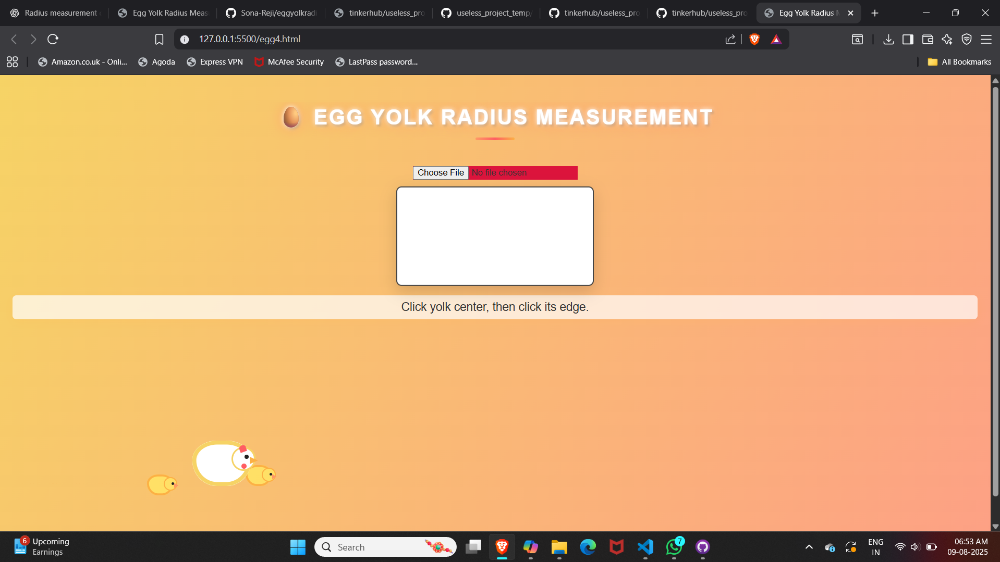
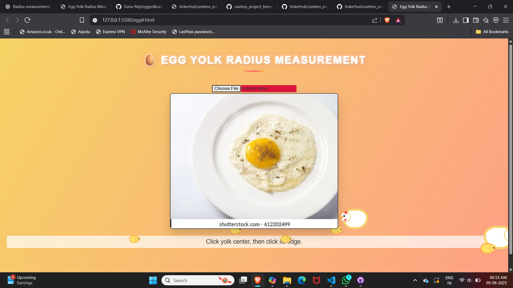

# [EGG YOLK RADIUS CALCULATOR] 🎯

## Basic Details
### Team Name: [init()]

### Team Members
- Team Lead: Sona Reji- Govt.Engineering College Idukki
- Member 2: Ashnitha K - Govt.Engineering College Idukki

### Project Description
It's funny but it is creative.

### The Problem (that doesn't exist)
Nobody knows the exact size of their egg yolk. Breakfast is in chaos.

### The Solution (that nobody asked for)
Upload an egg photo, click twice, and boom—perfect yolk radius in cm. Science meets omelets.

## Technical Details
### Technologies/Components Used
### Technologies/Components Used
For Software:

Languages used – HTML, CSS, JavaScript

Frameworks used – None (pure vanilla web magic)

Libraries used – None (no jQuery, no distractions)

Tools used – Browser Developer Tools, any image editor (optional for egg pics)

### Implementation
For Software:
Here’s a short and clear version for your project:

---

### **Implementation**

For Software:

1. Image Upload– User selects an egg photo via a file input.
2. Canvas Rendering – The image is drawn on an HTML `<canvas>`.
3. Click Detection – First click marks yolk center, second click marks yolk edge.
4. Radius Calculation – JavaScript calculates pixel distance, converts to centimeters using a scaling factor.
5. Visual Feedback – Points and circle are drawn on the canvas, and the radius is displayed on screen.

# Installation
[gitHub]

# Run
git init
git add .
git commit -m "message"
git push -u origin master/main

### Project Documentation
For Software:

# Screenshots (Add at least 3)

*front page*

* uploading image*

*final output*

# Diagrams

*Add caption explaining your workflow*

For Hardware:

# Schematic & Circuit

*Add caption explaining connections*

*Add caption explaining the schematic*

# Build Photos

*List out all components shown*

*Explain the build steps*

*Explain the final build*

### Project Demo
# Video
[Add your demo video link here]
(https://drive.google.com/file/d/1zfPW5gG6GUioRvCkQWpfrVF22bLL8Fg0/view?usp=drive_link)

# Additional Demos
[Add any extra demo materials/links]

## Team Contributions
- [sona Reji]: [animation,javascript]
- [ashnitha ]: [html]

---
Made with ❤️ at TinkerHub Useless Projects 

